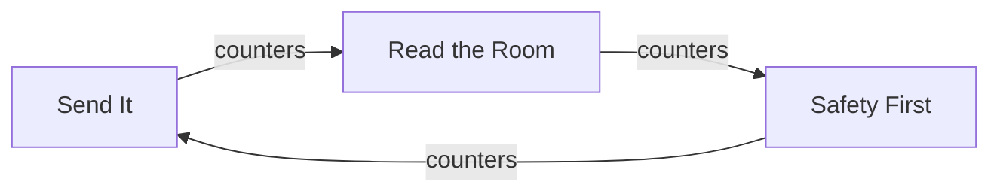
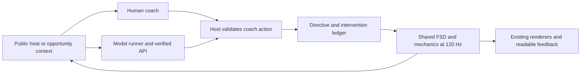

# GroketLeague: FSD Cups with human and model decisions

Plan and playable slice revised: September 30, 2026. Implementation branch: `codex/fsd-cups`, based on `0e6360b`.

Status: **local FSD Cup beta implemented**, with three 60-second heats, secret directive picks, limited interventions, cup points, six earned roof decals, equipment and a persistent guest collection. The first rival is explicitly a scripted CPU. Live model coaching, private-room cups and streamer participation remain future work. The user selected **quick 1v1 cups with unlockables** as the first release. FSD remains the driver; numbers below remain tuning hypotheses, not balance claims.

## Playable beta

Choose a car, then **FSD Cup - Beta** on the garage home screen. Before each heat select Send It, Safety First or Read the Room. The CPU commits before the human pick; both reveal together. Space/Shift arms one boost during an offered opening; E arms the car's signature move. Touch buttons use the same action route. Holding a key never purchases repeated interventions. An armed action spends one charge only after actual simulation activation; cancelled or expired reservations keep the charge. Goals and recalibrations carry remaining charges into the next faceoff.

Each completed cup grants 50 Warranty Claims, plus 25 for a win or shared cup. The first completion unlocks Certified Beta, an actual roof decal available to equip immediately. Warranty Voided requires a cup win, Roadside Assistance a save, and the remaining decals 150/300/500 cumulative claims. All four cars and their moves start available. Saves and equipment belong to this browser; blocked or full storage produces a visible temporary-save notice. These guest results are unverified local practice progress.

Cup-specific pacing lets a defensive FSD contest a ball that has not progressed for four seconds. After eight seconds without two world units of ball progress, the match visibly recalibrates to a neutral faceoff. The active heat clock, score and intervention allowance continue. This changes no classic match tactic behavior, vehicle dimensions or physical contact rules.

Implementation boundaries:

- `cup.js`: versioned heat rules, private CPU draft commitment, counter bonus, points and dead-ball pacing.
- `opportunities.js` and `coach-controller.js`: one reservation per seat, legal actions, activation receipts and explicit FSD intervention input.
- `progression.js`, `cosmetic-art.js`, `pixel.js`: versioned guest save, exactly-once cup receipts, milestones, roof decals in both renderers.
- `cup-ui.js` and `cup.css`: DOM draft/reveal/summary/rewards, collection and controls outside the arena.
- `agent-observation.js`: public context boundary for future provider adapters. This is an application contract, not an invented Decisions API schema.
- `main.js`: local cup lifecycle. Existing human online matches remain separate; this beta adds no network cup protocol or hosted inference service.

No API credentials or paid model requests were used. The official [guide index](https://developers.openai.com/api/docs/llms.txt) and [reference index](https://developers.openai.com/api/reference/llms.txt) were rechecked during implementation and still had no Decisions entry. Provider access and request schema need verification before the next model milestone.

## Product direction

GroketLeague is an autonomous car-soccer spectacle with a few consequential player decisions. The fantasy is: pick your ridiculous car, make an overconfident call, authorize a couple of interventions, and watch FSD try to justify your confidence.

Preserve the satire around Rocket League, Tesla/FSD, Grok, X, SpaceX and participatory stream games while giving the game its own rules and voice. Car identity, rival coaches, limited authority over FSD, and earned garage cosmetics can make this more than a collection of references.

FSD owns steering, throttle, aiming, avoidance and recovery. Human and model players act as coaches with the same finite choices, resources and deadlines. Learned model inference chooses the coach's actions; the shared driving remains deliberately authored game logic. Label the combination honestly, for example **Coach: Luna / Driver: FSD**. The existing opponent named GROK is a scripted CPU, not evidence of a live Grok API connection.

The first release combines three forms of appeal:

- **Spectacle:** watchable autonomous action, readable mishaps, original car personalities and funny outcomes.
- **Counterplay:** a simple sealed choice between heats and a few opportunities to spend scarce interventions.
- **Attachment:** a cup result, rivalry record, garage collection and an earned cosmetic after the first completed cup.

Use Game Studio's simulation/render separation, explicit input rules, DOM HUD and playtest workflow. Retain the existing static ES modules, shared car contract and 2D/3D renderers.

## First playable format: quick 1v1 cups

Start on the classic Arcade 2D pitch with three heats, initially **60 seconds per heat**. Goals decide each heat: win = 3 cup points, draw = 1 each, loss = 0. Most cup points wins the cup; an equal total produces a shared cup. Goals already scored in a heat should remain visible. A cancelled or disconnected cup is incomplete, rather than a fabricated win.

This targets roughly three minutes of active play plus brief selections and transitions. A shorter heat is a later pacing experiment. Treat the current first-to-three/90-second classic match as a separate existing ruleset; define the new cup rules explicitly in configuration and network compatibility.

A cup flows as follows:

1. Pick one of the four available cars and a human, model or clearly labeled CPU opponent.
2. Select a sealed FSD directive before the first heat.
3. Reveal both calls and the counterplay result; show each player's intervention allowance.
4. Watch the heat and accept, decline or save resources during offered opportunities.
5. Show the heat result; choose again with knowledge of the opponent's previous behavior.
6. Award the cup result and earned progression once; show the new cosmetic and an immediate rematch.

Begin with Human vs Model, Human vs Human private rooms and a labeled CPU practice option. Model vs Model uses the identical cup rules as a watched exhibition. Build the local rules with fixture/CPU controllers while provider access is resolved; fixtures must never be labeled as a real model.

## Rock-paper-scissors layer: directives and a small advantage

Proposed labels and their relationship to current tactics:

| Directive | FSD tendency | Existing tactic | Counters |
|---|---|---|---|
| Send It | Commit earlier and pressure the ball | Attack | Read the Room |
| Safety First | Protect the goal and take defensive positions | Defend | Send It |
| Read the Room | Use the default adaptive FSD behavior | Auto | Safety First |

The **counter relationship is an explicit new cup rule**, not a claim that today's physical tactic behaviors already form a balanced triangle.

For the first experiment, every seat receives two intervention charges per heat. Winning the sealed counter-choice grants one extra charge for that heat; equal choices grant neither a bonus. The allowance resets at the next heat, not after every goal. Profiles affect the shared FSD tendency; the bonus gives a limited extra opportunity without deciding the score.

This lets someone think, "They keep sending it, so I'll pick Safety First," while the resulting match still depends on car behavior, interventions and the physical contest. The triangle does not guarantee an individual heat win. Assess whether the bonus is too strong, too weak, or leads to an obvious best profile when combined with a particular car.

Keep the selected directive fixed through a heat. The current A/S/D bindings should select in the draft phase in cup mode; live key presses must not silently switch away from the sealed choice. Existing classic-mode controls retain their own rules.

Use an approximately five-second selection phase, with a visible ready confirmation. Late/no selections use a declared neutral default, Read the Room. Reveal only after both choices lock or the phase ends. The model receives previous public choices and results, never the human's current hidden choice.

For online human opponents, use a salted commitment followed by reveal after both commitments lock; validate heat identity and timeouts. An authoritative service is needed later for competitive result integrity. The current PeerJS browser host is suitable for a casual initial prototype, but secret-choice handling must still avoid giving the host a free counter-choice through the normal UI or agent observation.

## Real boost opportunities with a small decision budget

Make a boost request useful during a real opportunity. A starting seat has two interventions to spend in a heat; the counter-choice winner has three. One charge can authorize a short boost burst or the car's signature move when the offered action is legal.

Examples of context for an offer:

- An attack is forming and FSD is preparing a useful approach.
- A goal-side interception or save is developing.
- A contested ball gives a ready signature move a plausible use.

A winning player should still have to decide whether this opportunity is worth a scarce charge. Declining keeps the charge for a later opportunity. Resources and offers are scoped to the heat, so button spam and repeated goals cannot replenish them.

The current `timingCue()` is a useful signal for a precise contact opportunity, but it only looks roughly 300 ms ahead; Perfect Touch uses a 240 ms window. Those timings are unsuitable as the sole casual-player or cloud-model decision window. Add an earlier **approximately 2.5-second authorization window**, then let shared FSD mechanics execute a valid approved action.

The player decides whether to authorize. The engine handles the short burst and the exact valid mechanical start, identically for human and model. This preserves the casual autonomous feel without requiring sub-second reflexes.

Proposed lifecycle:

1. Host publishes a seat-specific opportunity ID, allowed actions, public context and expiration.
2. Player chooses **Boost**, **Signature Move**, or **Pass**, from the offered legal subset.
3. Host validates remaining charges and reserves at most one charge for an approved pending action.
4. Activate at the next legal moment within the same bounded opportunity. For a boost, start with a 250 ms burst; retain reserve, rearm, safety, shock and recovery rules.
5. Spend the reserved charge only when the action actually starts. Release it if the opportunity expires, conditions fail, a goal resets the round, or the heat ends.
6. Report **Armed**, **Activated**, or **Cancelled / charge kept**, so the player can tell what happened.

The earlier cue, opportunity generator, reservation and activation bridge are new work. They are not provided by the current `BURST NOW` flash.

A small burst effect and a visible receipt should show actual activation. Meme copy can accompany a request, but the UI must distinguish a pending request, a real effect and a rejected/expired action. A button outside a valid window can be disabled with a clear explanation. Stream commands later use these same rules.

Keep signature windup, cooldown, recovery and the four distinct move effects. Charge and physical boost reserve are separate constraints: the charge authorizes one intervention, and the existing reserve limits its execution. Show charges prominently; detailed resource rules can stay in help.

In cup mode, always supply an explicit boost boolean and explicit special request to `botAI()` for both seats. Its current undefined boost argument permits automatic CPU boost and signature-move selection. The coach ledger must govern those interventions on model/human cup seats. FSD steering and recovery continue normally even while no intervention is active.

## Stakes, progression and unlockables

For this release, stakes mean cup trophies, rivalries, personal records and earned cosmetic progression.

Start with one progress track, tentatively **Warranty Claims**. Example tuning: 50 claims for a completed cup and 25 extra for a cup win or shared cup. Use cumulative milestones and specific achievements to unlock cosmetics; a separate shop economy is unnecessary for the first slice.

Keep all four existing cars, directives and competitive mechanics available at entry. Put progression into visual personality:

| Milestone | Example unlock |
|---|---|
| Complete the first cup | An original starter plate or sticker, guaranteed regardless of result |
| Win the first cup | Warranty Voided badge |
| Make a save with an approved signature move | Roadside Assistance sticker |
| Beat a named model rival | I Read the Terms title |
| Finish several cups with a chosen car | That car's alternate palette or boost trail |

Ship a small complete collection, approximately six to eight cosmetics. A persistent trophy shelf, best win streak and record against named rivals can add personal stakes. A lost cup ends a win streak but does not remove earned cosmetics or progress.

Achievements for defeating a named model require a completed live-model session. Fixtures or a coach that became unavailable cannot grant a verified model-victory badge; a completed casual exhibition can still grant ordinary participation progress.

Colors, trails and celebration effects must preserve team identification, ball visibility and collision geometry. A first reward should be visible immediately, equip in one action, and carry into the next cup. Progression success depends on wanting another match; reward counters cannot establish that on their own.

Use guest local persistence for the first casual prototype. Provide versioned storage, defensive loading, an equipment selection, and an idempotent completed-cup receipt so reload/rematch cannot award the same result twice. Detect unavailable storage and tell the player when progress will be temporary.

Cloud saves and public competition are later infrastructure work: stable identity, durable storage, server-validated results, reward transactions, and a way to recover progress across devices. Current X sign-in fetches a handle/profile; it does not implement persistent game rewards, cup history or a trusted leaderboard. Browser IDs are also insufficient as trusted reward identities.

## Live models: the same coach role as the human

The model has two meaningful decision types:

- **Before a heat:** pick Send It, Safety First or Read the Room from public matchup information and previous heat history.
- **During an opportunity:** choose one allowed intervention or Pass, using the public game situation and remaining resources.

FSD remains authored game code. The model's strategy and intervention choices come from live inference. This is the intended combination of autonomous spectacle and model competition. Telemetry must distinguish live model choices, fixture choices and CPU choices.

Two model players have separate requests, observations, optional public-history summaries and resource ledgers. Their calls run concurrently without exposing the opponent's current sealed selection, pending action or private prompt. Show the actual model provider/name alongside the FSD driver label.

The September 29 [official OpenAI DevDay recap](https://openai.com/index/devday-2026-recap/) describes Decisions API as Luna answering questions with predefined finite answers using text or image context. That fits the proposed three-way coach decisions. It remains a limited-preview announcement; no account access, request schema, pricing or measured latency is established by this plan.

The public API guide/reference indexes checked earlier on September 30 had no Decisions entry. Use official preview/release documentation when available. Do not invent an endpoint or assume a chat subscription supplies API access. A provider-neutral gateway can also support a deliberate [Responses Structured Outputs](https://developers.openai.com/api/docs/guides/structured-outputs) experiment.

A standalone model runner handles the repeated decisions. This Codex chat can build, test and supervise that runner; it is not automatically a continuously connected player. Inference happens on heat selection and opportunity events, rather than on every simulation frame.

For example, one directive request and four offered-opportunity requests per heat produces roughly 15 requests per model per three-heat cup, or 30 for two model coaches, before retries. Actual offers and costs depend on measured gameplay and provider billing. Set an initial hard cap of 30 requests per model per cup, including retries, plus an explicit spend budget before running paid tests.

A first latency target is a model choice applied within about 750 ms of the offer, comfortably inside the proposed 2.5-second window. This is an engineering target, not an OpenAI speed claim. Measure provider time, gateway/transport time, remaining window time at acceptance, and late/missed opportunities. A late model passes; FSD continues and the UI reports the unavailable coach. Never silently award a scripted intervention while labeling it as model-selected.

## Observation, authority and implementation boundaries

Keep the 120 Hz simulation outside renderers. Human input and model output both enter the same host-validated coach action interface; nobody writes directly to velocity, scores, charges or rewards.

Filter observations to the declared public state: physical situation, score/clock, displayed FSD status, legal opportunity actions, own available charges, publicly revealed directives and previous results. The full `render_game_to_text()` currently includes internal planner state and the match seed; it is a diagnostic source, not an approved observation payload.

A structured-state model receives more exact spatial information than a human viewing pixels. Label that initial experiment and measure it separately from a later screenshot/HUD-only model. Both still use the same opportunity deadlines and authorization assistance.

Attach cup, heat, round epoch, seat, opportunity ID/version and input sequence in the application. Validate duplicates, wrong seats, cancelled/expired windows and old epochs. Anchor deadlines to host time; a late response cannot extend its opportunity. Clear reservations and pending provider responses on goal/reset, heat end, leave and cup cancellation.

The present net loop runs input/state at 20 Hz and cuts stale held input after 500 ms. Cup actions should be explicit acknowledged events with semantic opportunity deadlines, rather than repeatedly sending a held boost bit as authority. Version/hash the cup rules and refuse incompatible clients.

Use a local Node gateway for first model experiments and keep credentials there. The current static frontend needs no bundler migration. Watched model exhibitions can use the browser host; unattended competitions later need an authoritative runtime that survives tab suspension and disconnection.

## Current foundations and new work

| Existing source | Foundation | Required cup change |
|---|---|---|
| `input.js`, `main.js` | Tactics, explicit boost, ability input, match lifecycle | Draft phase, offered choices, cup HUD and event routing |
| `autopilot.js`, `sim.js` | Shared FSD, distinct car tendencies, attack/defend/auto | Preserve FSD; use explicit coach intervention intent; assess pacing |
| `skills.js`, `boost.js` | Timing cue, Perfect Touch, reserve/rearm and signature rules | Earlier authorization offers, bounded activation and accurate receipts |
| `match-variety.js` | Seeded varied faceoffs and car personality | Consistent heat setup and public reveal history; do not leak future seeds |
| `physics-clock.js`, `simulation-config.js` | Fixed 120 Hz and shared frozen configuration | Explicit versioned cup rules and initial tuning values |
| `net-protocol.js`, network handlers | Host physics, version/hash, rematch reuse | Sealed choices, acknowledged opportunity events, heat/epoch checks |
| `x-auth.js`, `api/x-me.js` | Display identity | Later verified account-to-save association; no existing progression backend |
| `moon.js` | Separate three-heat race presentation | Reference for a cup flow; Moon simulation and scoring remain separate |

Proposed small modules:

- `cup.js`: heat phases, sealed choices, counter matrix, allowances and results.
- `opportunities.js`: offers, reservations, legal activation, expiry and action receipts.
- `coach-controller.js`: human/model/CPU/fixture decisions through the same action interface.
- `agent-observation.js`: audited public context.
- `progression.js` and a small cosmetic catalog: versioned saves, unlock milestones and equipment.
- `tools/agent-runner/`: gateway, verified provider adapters, request/spend caps and inference receipts.

## Implementation order and release gates

1. **Playable local cup:** cup phases, three directives, counter bonus, intervention windows and clear receipts, using human/CPU/fixture controllers. Reuse FSD and verify all four cars. This step can proceed before Decisions access.
2. **Pacing and counterplay:** natural matches across ordered car pairs, directives and several seeds; then human playtests. Assess useful choices, readable activation, goal/save frequency, long inactivity, preference for rematch and whether a car/profile dominates. Fix material issues before rewarding repetition.
3. **First progression slice:** one guaranteed first-cup unlock, a small cosmetic collection, equipment UI, cup/rivalry history, local save recovery and exactly-once rewards.
4. **Real model coaches:** verified provider/schema/access, capped live tests, Human vs Model and Model vs Model, timeout behavior and independent seat observations. Live inference receipts are required before labeling a mode model-driven.
5. **Private-room cups and broader presentation:** seal/reveal and transport tests, rematches/disconnects, full cup progression in both graphics modes, desktop/mobile/reduced-motion UI review. Later add cloud saves and trusted competitive results if the loop earns that investment.
6. **Streamer rooms after the selected first release:** audience enrollment, named participants, team choices and real opportunity-bound chat requests. Reuse the same rules.

The progression slice does not require global ranked matchmaking, a season pass, inventory trading or an always-on account service. Public ratings and cross-device unlocks require those relevant server/identity foundations when introduced.

## Future streamer participation

The [official Marbles getting-started guide](https://www.pixelbypixelstudios.live/getting-started) demonstrates named chat entrants, spectator races and cosmetic loadouts. Use that participatory watchability as inspiration; our first version remains the selected 1v1 cup.

A later room can accept a team choice and one vote per eligible viewer per opportunity. An audience `!boost` request can affect the match only through the same legal intervention allowance and host rules. Additional repeated messages do not multiply force. Use a deterministic announced threshold or majority rule, bounded per verified viewer, with a visible accepted/expired result.

Real Twitch integration needs app registration, broadcaster authorization, a chat receiver and room membership/vote handling. Twitch documents receiving chat through [EventSub Channel Chat Message](https://dev.twitch.tv/docs/chat/send-receive-messages). Platform chat delay needs its own longer window test; the 2.5-second in-app target cannot simply be assumed to work for a stream audience. No platform messages were sent in this research.

## Evidence and remaining uncertainty

- Planning baseline at `0e6360b`: inspected FSD controls, CPU intervention selection, timing cue/Perfect Touch, physical resource limits, net cadence, X display identity and existing storage. That checkout had no persistent soccer unlock/reward system. The local cup beta now adds guest progression.
- Re-fetched OpenAI's official Decisions announcement and primary Marbles/Twitch participation documentation. No live model call was made.
- Ran 48 deterministic first-goal probes on the current classic 2D FSD across all 16 ordered car pairs and three seeded setups: **18 scored by 45 seconds, 27 by 60 seconds, 21 were scoreless at 60 seconds**. Both seats used current automatic CPU boost/moves, with no new cup rules or model inference. Receipt: `output/agent-plan-research/fsd-first-goal.json`.
- This small baseline measures current first-goal timing, not enjoyment, balance, complete cup outcomes or the proposed intervention system. It justifies a pacing gate and caution about very short heats. Scoreless play is not automatically boring; the human playtest must establish whether the contest is watchable.
- The earlier 8/8 direct-input probe showed a mechanical hook, but direct manual steering is not part of this revised core plan.
- The window timings, counter bonus, rewards and heat duration remain tuning hypotheses. Provider access/cost/latency, balanced counterplay, human enjoyment, online progression, cup networking and complete model cups still need implementation and evidence.
- Local beta validation: 115 unit/regression checks passed; six cup browser layouts passed (desktop, phone, small phone, landscape, small landscape, reduced motion), including all four cars, complete fixture cups, same charges after goals, exactly-once rewards, equipment, reload and cancellation. Browser scenario fixtures are injected only into local intercepted responses; none ship in the game.
- Full-clock browser cup completed without score/time fixtures: heats 3-0, 1-0, 0-0; cup points 7-1; 75 claims and the first-completion/first-win decals awarded once. Keyboard requests were a scripted browser fixture, not a human enjoyment playtest or model inference. Receipt: `output/fsd-cup/natural-results.json`, sampled actions: `output/fsd-cup/natural-trace.json`. Classic arena UI also passed eight 2D/3D desktop/mobile cases; deployed Vercel preview booted into a real cup heat without source interception.
- Existing gameplay regression passed: 2D/3D goals, clocks, pauses and offline rematches; actual private-room host/guest handshake, boost, tactics, moves and chat; authoritative results and same-session rematch; disconnect cleanup; 3D quick match and mobile controls. Receipt: `output/fsd-cup/classic-regression/results.json`.
- Cup pacing sample: 48 seeded scripted CPU-vs-CPU cups / 144 heats, all 16 ordered car pairs. Initial sample: 72 goals, 96 scoreless heats, 24 shared cups and a 60-second slow-ball stretch. Cup pacing update: 101 goals, 78 scoreless heats, 15 shared cups and a 16.725-second longest slow-ball stretch. Both seats used the same limited intervention rules; 656 interventions activated without exceeding allowances. This remains a synthetic sample, not evidence of human enjoyment, balance or model quality. Receipt: `output/fsd-cup/pacing.json`; previous sample: `output/fsd-cup/pacing-before.json`.

The first deliverable is a watchable FSD cup with a few understandable decisions and an immediately visible earned cosmetic. Once that loop works, real model coaches compete under the same rules.
